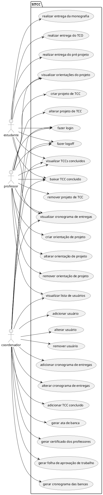

# Especificação dos Requisitos do SITCC

## Requisitos Funcionais

### Lista de Requisitos Funcionais

- RF01 - O sistema requer uma página de Login com usuário e senha
- RF02 - O sistema precisa ser capaz de enviar um link para o email do usuário para recuperar a sua senha
- RF03 - O sistema deve permitir ao coordenador do TCC incluir/excluir  usuários, com estes podendo ser discentes, docentes e possivelmente um novo coorndenador
- RF04 - O sistema precisa possuir uma reserva com todos TCC's concluidos, e permitir a obtenção de seus arquivos por qualquer tipo de usuário
- RF05 - O sistema tem que permitir ao coordenador criar um cronograma de entregas das atividades da disciplina de TCC, que pode ser visualizado por todos usuários
- RF06 - O sistema necessita que o discente tenha uma área para fazer a entrega das atividades da disciplina de TCC, como TCO(termo de concordância de orientação), pré projeto e a monografia
- RF07 - O sistema deve ser capaz de gerar arquivos como ata de banca, certificados dos professores, folhas de aprovação dos trabalhos e cronograma das bancas. Com o coordenador sendo o único com acesso a essa função
- RF08 - O sistema requer que os docentes possam criar/excluir projetos de TCC e víncular um aluno e possivelmente um co-orientador a este
- RF09 - O sistema deve permitir aos docentes orientadores e co-orientadores de um projeto de TCC postarem orientações para o discente vínculado a este
- RF10 - O sitema necessita que o discente ao ser vínculado a um projeto seja capaz de acessar uma página contendo as orientações dos orientadores e, caso haja, co-orientadores

### Diagrama de Casos de Uso

### Especificicações de Casos de Uso

- [UC_01](reqs_UC01.md)
- [UC_02](reqs_UC02.md)

## Requisitos não-funcionais

### Usabilidade

... Segundo ... Nilsen ...

## Referências

[1] Nilsen ...

[2] Ian Somerville ...

[3] Angular ...

[4] PlantUML ...
