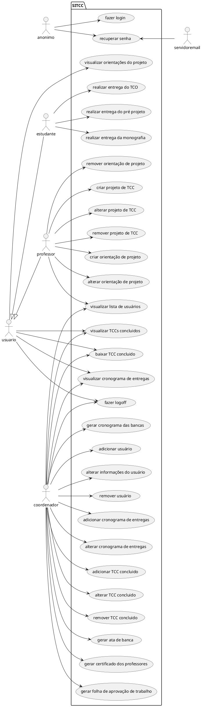

# Especificação dos Requisitos do SITCC

## Requisitos Funcionais

### Lista de Requisitos Funcionais

- RF01 - O sistema requer uma página de Login com usuário e senha
- RF02 - O sistema precisa ser capaz de enviar um link para o email do usuário para recuperar a sua senha
- RF03 - O sistema deve permitir ao coordenador do TCC incluir/excluir  usuários, com estes podendo ser discentes, docentes e possivelmente um novo coorndenador
- RF04 - O sistema precisa possuir uma reserva com todos TCC's concluidos, e permitir a obtenção de seus arquivos por qualquer tipo de usuário
- RF05 - O sistema tem que permitir ao coordenador criar um cronograma de entregas das atividades da disciplina de TCC, que pode ser visualizado por todos usuários
- RF06 - O sistema necessita que o discente tenha uma área para fazer a entrega das atividades da disciplina de TCC, como TCO(termo de concordância de orientação), pré projeto e a monografia
- RF07 - O sistema deve ser capaz de gerar arquivos como ata de banca, certificados dos professores, folhas de aprovação dos trabalhos e cronograma das bancas. Com o coordenador sendo o único com acesso a essa função
- RF08 - O sistema requer que os docentes possam criar/excluir projetos de TCC e víncular um aluno e possivelmente um co-orientador a este
- RF09 - O sistema deve permitir aos docentes orientadores e co-orientadores de um projeto de TCC postarem orientações para o discente vínculado a este
- RF10 - O sitema necessita que o discente ao ser vínculado a um projeto seja capaz de acessar uma página contendo as orientações dos orientadores e, caso haja, co-orientadores

### Diagrama de Casos de Uso

### Especificicações de Casos de Uso

- [UC_01](reqs_UC01.md)
- [UC_02](reqs_UC02.md)
- [UC_03](reqs_UC03.md)
- [UC_04](reqs_UC04.md)
- [UC_05](reqs_UC05.md)
- [UC_06](reqs_UC06.md)
- [UC_07](reqs_UC07.md)
- [UC_08](reqs_UC08.md)
- [UC_09](reqs_UC09.md)
- [UC_10](reqs_UC10.md)
- [UC_11](reqs_UC11.md)
- [UC_12](reqs_UC12.md)
- [UC_13](reqs_UC13.md)
- [UC_14](reqs_UC14.md)
- [UC_15](reqs_UC15.md)
- [UC_16](reqs_UC16.md)
- [UC_17](reqs_UC17.md)
- [UC_18](reqs_UC18.md)
- [UC_19](reqs_UC19.md)
- [UC_20](reqs_UC20.md)
- [UC_21](reqs_UC21.md)
- [UC_22](reqs_UC22.md)
- [UC_23](reqs_UC23.md)
- [UC_24](reqs_UC24.md)
- [UC_25](reqs_UC25.md)
- [UC_26](reqs_UC26.md)
- [UC_27](reqs_UC27.md)
- [UC_28](reqs_UC28.md)
- [UC_29](reqs_UC29.md)
## Requisitos não-funcionais

- RNF01 - O sistema será acessado através de um login e senha cadastrados pelo coordenador. 
  Os usuários possuirão um longin e uma senha de uso individual e restrito ao usuário.

- RNF02 - Dados de acesso do usuário devem ser protegidos.
  Os dados dos usuários devem ser protegidos para o sistema apresentar uma maior segurança 

- RNF03 - O sistema possuirá três níveis de acesso, sendo eles aluno, professor e coordenador, com privilégios distintos.
  O nível de acesso definirá as permissões de cada usuário, sendo o Coordenador o usuário de maior privilégio no sistema.

- RNF04 - Uso de Design responsivo para as telas. 
  O sistema deve ser responsivo, ou seja, seus formatos e layouts devem conseguir responder aos diferentes tamanhos e resoluções de tela disponíveis.

- RNF05 - Compatibilidade com os navegadores.
  O sistema deve apresentar compatibilidade com a maioria dos navegadores, reduzindo o número de limitações nos mesmos.

- RNF06 - O sistema deverá ser prático e simples de usar.
  O sistema deve ser de fácil uso para qualquer usuário, sem ser necerrário o conhecimento de programação para utilizá-lo.

## Referências

[1] Nishi, Fernando Massao Franzin
REQUISITOS REQUISITOS DE REQUISITOS DE SOFTWARE: REQUISITOS DE SOFTWARE: PROPOSTA, REQUISITOS DE SOFTWARE: PROPOSTA, ESPECIFICAÇÃO REQUISITOS DE SOFTWARE: PROPOSTA, ESPECIFICAÇÃO E
OTIMIZAÇÃO OTIMIZAÇÃO DE OTIMIZAÇÃO DE UM OTIMIZAÇÃO DE UM METAFRAMEWORK OTIMIZAÇÃO DE UM METAFRAMEWORK PARA OTIMIZAÇÃO DE UM METAFRAMEWORK PARA A OTIMIZAÇÃO DE UM METAFRAMEWORK PARA A DOCUMENTAÇÃO OTIMIZAÇÃO DE UM METAFRAMEWORK PARA A DOCUMENTAÇÃO / OTIMIZAÇÃO DE UM METAFRAMEWORK PARA A DOCUMENTAÇÃO / Fernando
Massao Franzin Massao Franzin Nishi Massao Franzin Nishi ; Massao Franzin Nishi ; orientação Massao Franzin Nishi ; orientação de Massao Franzin Nishi ; orientação de Cleverson Massao Franzin Nishi ; orientação de Cleverson Tabajara
Vianna; Vianna; coorientação Vianna; coorientação de Vianna; coorientação de Underléa Vianna; coorientação de Underléa Cabreira
Corrêa. Corrêa. - Corrêa. - Florianópolis, Corrêa. - Florianópolis, SC, Corrêa. - Florianópolis, SC, 2019.
123 p.

[2] Ian Somerville ...

[3] Angular ...

[4] PlantUML ...
